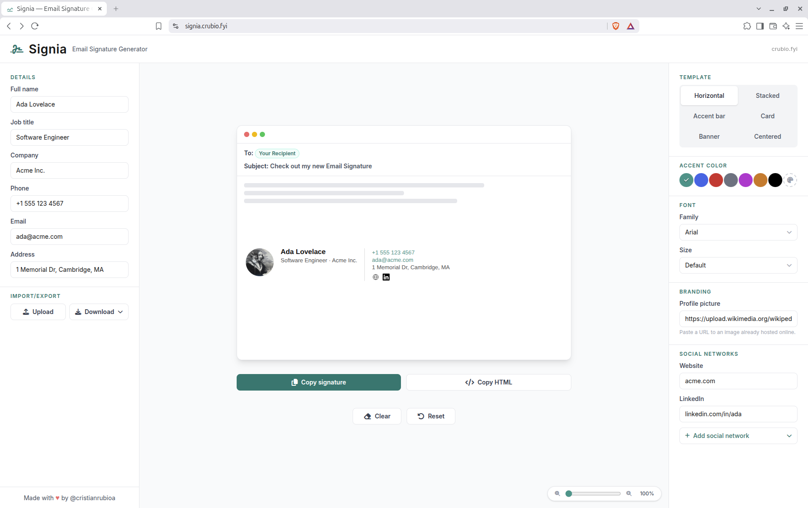

# Signia




HTML email signature generator — clean, client-safe, ready in under a minute. Runs entirely in the browser: no backend, no account, no tracking.

## Run locally

```bash
npm install
npm run dev      # http://localhost:5173
```

## Scripts

| Command             | What it does                          |
| ------------------- | -------------------------------------- |
| `npm run dev`        | Development server (Vite)             |
| `npm run build`      | Type-check + production build         |
| `npm run preview`    | Serves the production build locally   |
| `npm run lint`       | Lint with oxlint                      |
| `npm run test`       | Tests with Vitest (80% coverage floor) |

## Stack

React 19 + TypeScript + Vite + Tailwind 4. No backend: signature data is stored in the browser's `localStorage`. The only runtime dependency beyond React is `js-yaml`, used for config import/export.

## Deploy

Vercel auto-detects the Vite preset — `npm run build` outputs `dist/`, no extra config needed. There's no client-side routing (single page), so no SPA rewrite is required either.
